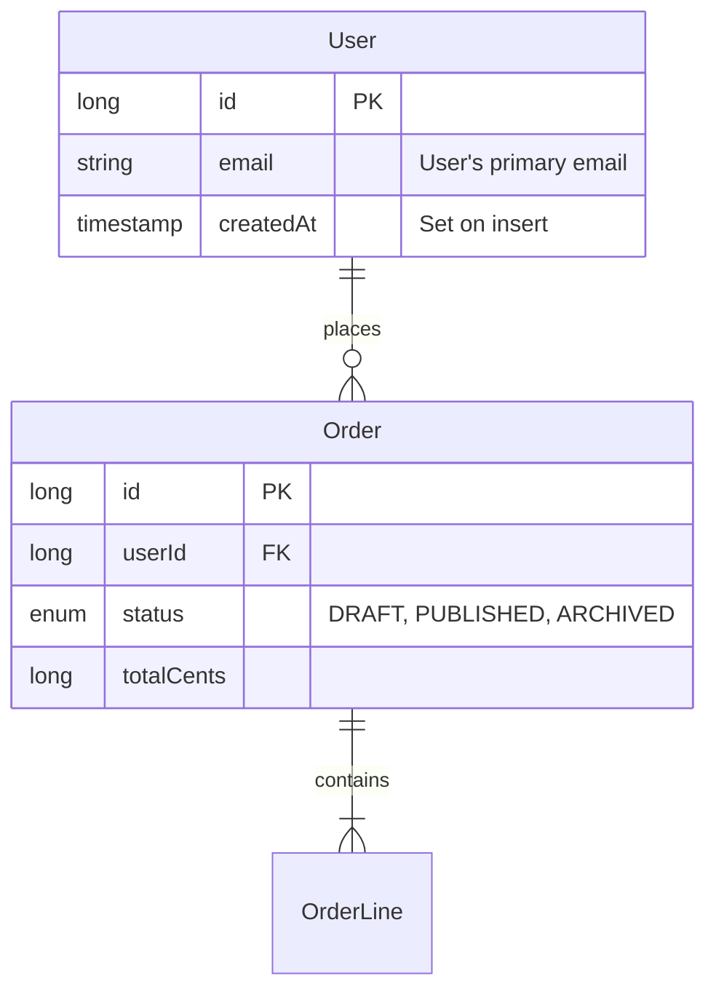

# Design: Documentation provider — universal doc common attrs + cross-language doc-gen

**Date:** 2026-05-24
**Status:** Implemented across TS, C#, Java (substrate; wiring deferred to H3b), Python (2026-05-24)
**Author:** Doug Mealing (with Claude)

## Problem

The metamodel has **no user-instance documentation slot** today. Every `description` field in the codebase lives in registry-level `AttrSpec` definitions describing the *metamodel itself* (e.g. "Maximum character length for string-typed fields"). User-authored entities, fields, identities, sources, etc. carry no documentation, summary, deprecation marker, see-also link, or alias — so per-language code generators have nothing to flow into JSDoc / XML-doc / docstrings, no `[Obsolete]` source to act on, and AI agents reading the metamodel have only the structural shape to reason about.

This blocks three concrete consumers:
1. **Doc-gen** — generated `User`, `Order`, `Subscriber` types in TS / C# (and eventually Java / Python) ship today without doc comments. IDE hover shows the type but no semantics.
2. **AI authoring assistance** — Claude proposing or editing metadata has no `description` / `aliases` / `seeAlso` text to disambiguate "is this `email` the same as `contactEmail`?".
3. **MCP / LLM tool exposure** (future) — once MCP tool registration lands, every tool / parameter exposed to an LLM needs a `description`; the metamodel can't currently supply one.

## Goals

1. Add a **first-class documentation substrate** authored on user instances (entities, fields, identities, sources, relationships, layouts, anything).
2. Use a small set of **universal common attrs** — one source of truth, every node accepts them — rather than per-type scattering of doc schemas or wrapper-child ceremony.
3. Make the substrate **load + validate + round-trip + conformance-test** identically across **TS / C# / Java / Python**.
4. Ship **immediate-feedback doc-gen consumers** in TS + C#: in-code doc comments + Postgres column/table comments + a Mermaid ER diagram of the model.
5. Provide a **behavior-derivation contract** so codegen for `readOnly` / `writeOnly` / `computed` / `immutable` / `identifier` is computed from *existing* persistence metadata — not authored as duplicative annotations.
6. Define this as **Spec 1 of 2 in a decomposed knowledge-layer effort** (Spec 2 = Governance metatype family for PII / PHI / classification with structured runtime-data-control payloads). A third would-be spec on behavior-hint derivation is absorbed into this one as the derivation contract table in D6 — separate doc not needed.

## Non-goals (out of scope)

- **Governance / classification / PII / PHI / sensitivity metadata.** This is a different concern (selective, structured, runtime-behavior-driving) that earns a metatype family of its own — its own spec (Spec 2). Not folded in here.
- **Behavior hints as new attrs.** `readOnly` / `writeOnly` / `computed` / `immutable` / `identifier` are *derivable* from existing persistence metadata (`@autoSet`, `@generation`, `@version`, `identity.primary`, `source.rdb` with read-only `@kind`, `origin.*`). Authoring them as new attrs is duplicative annotation — the project principle "pattern-derivable from metadata = codegen" applies. The contract for these derivations is in this spec (cross-language consistency matters) but they are *not* new metamodel attrs.
- **`examples` slot** (OpenAPI-style labelled multi-example, or stringarray). YAGNI for v1 — doc-gen alone doesn't justify a structured `attr.examples` subtype. Promote when MCP / test-fixture generation / OpenAPI enrichment becomes a concrete consumer.
- **`annotations` slot** (open `key → string-value` extension via `attr.properties`). Same YAGNI cut — no concrete v1 consumer; promote when a real driver appears.
- **OpenAPI description enrichment, `meta docs` markdown site, `meta describe` CLI, MCP tool-description registration.** Each is a substantial effort in its own right; deferred.
- **Java / Python codegen consumption** of doc attrs (JavaDoc / docstring emission). Those ports get loader-recognition + round-trip + conformance in v1; codegen emission lands when their codegen tiers reach the relevant generators.
- **Java-side Mermaid generator.** The existing Java `codegen-plantuml` module stays untouched as the parallel/legacy graphical-view path for Java-tier users. v1 ships Mermaid only on the TS side.
- **A separate `clob` attr value type.** String attrs already support multi-line content via YAML's `|` block scalar — no new attr subtype needed for long-form text.

## Decisions

- **D1 — Seven universal flat doc attrs, registered through a new common-attrs hook on the TypeRegistry.** Value types match existing attr-subtype vocabulary; nothing exotic. Names match the dominant convention across Prisma / GraphQL / OpenAPI / JSON Schema / LinkML / MCP — `description` is *the* doc surface every system converges on.

| Attr | Value type | Required | Semantics |
|---|---|---|---|
| `description` | `string` (markdown allowed, multi-line via YAML `\|`) | no | What the element **is and covers**, for someone using it. Scope and boundary, derivable from the model itself. Flows into all doc-gen surfaces. |
| `title` | `string` (single-line) | no | Short human label — a **noun phrase**, never a sentence. For UI labels / doc headings, where the element's `name` is an identifier. |
| `notes` | `string` (markdown, multi-line) | no | **Internal-only** rationale. What you had to look **outside the model** to learn: evidence, citations, what breaks if this changes. Never emitted to user-facing docs. |
| `deprecated` | `string` (text reason) | no | Presence ⇒ deprecated. The string is the reason. LinkML-style; cleaner than a bare boolean. |
| `replacedBy` | `string` (FQN ref) | no | Pointer to the replacement element. Only meaningful with `deprecated`. |
| `seeAlso` | `stringarray` (URLs) | no | External documentation links. |
| `aliases` | `stringarray` | no | Alternate names. Aids AI authoring (disambiguation), search, migration. |

**The `description` / `notes` split is by CONTENT KIND, not by audience.** Splitting them on
who reads it ("user-facing prose" vs "internal-only rationale") is what the original wording
did, and it invites writing the same content twice at two levels of politeness — `notes`
becomes a longer `description` with citations bolted on. The rule that keeps them disjoint is
mechanical: *a sentence belongs in `notes` exactly when it would have to change because the
IMPLEMENTATION changed while the model did not.* A `description` is derivable from the model;
a `notes` is not. Found by dogfooding — filling both slots across a 245-entry ledger produced
visible overlap on every entry whose evidence was the interesting part.

- **D2 — `commonAttrs` hook is the only new registry mechanism.** Today every attr is registered per `(type, subType)`. We add `registry.registerCommonAttrs(attrs)` (or per-port idiomatic equivalent — Java fluent `registry.registerCommonAttribute(...)`, Python `provider.register_common_attrs(...)`). The existing per-type attr-validation pass merges common + per-type attrs before checking a node's attrs. **Permissive scope:** every metatype accepts the doc attrs, including `attr` / `validator` / `origin` nodes themselves. Codegen consumers ignore them where they're meaningless. Less surprise than a per-type allowlist; smaller cross-port machinery.

- **D3 — Conflict policy: hard fail at registration.** If a per-type attr name collides with a common attr name, throw `ERR_PROVIDER_ATTR_CONFLICT` (existing code) at registry composition. No silent override.

- **D4 — A dedicated `DocumentationProvider` per port, per ADR-0004.** Id `metaobjects-documentation`; depends on `metaobjects-core-types`. Each port's provider does exactly one thing: call `registry.registerCommonAttrs(commonDocAttrs)`. The hook itself is generic registry infrastructure — any future provider can use it for *its own* cross-cutting flat attrs. Mirrors how new metatype families are added today.

- **D5 — `notes` is internal-only by design.** No doc-gen surface emits it. It's the LinkML/CommonMetadata `notes` slot: a place to record "why this is shaped this way" without it bleeding into public docs.

- **D6 — Behavior hints are derived, not authored.** Codegen for `readOnly` / `writeOnly` / `computed` / `immutable` / `identifier` reads existing persistence metadata. The derivation rules are a cross-language contract; the table below is part of this spec so all four ports agree:

| Behavior | Derivation rule |
|---|---|
| `identifier` | Field is in `identity.primary @fields`. v1 is PK-only. Extending to `identity.secondary @unique: true` (natural identifiers à la Google's AIP-148) is a follow-on when a concrete consumer needs it. |
| `computed` (entity-level) | Host entity has `source.rdb` with `@kind` in the read-only set (`view`, `materializedView`, `storedProc`, `tableFunction`) per ADR-0007 — entire entity is derived / non-writable. |
| `computed` (field-level) | Field has `@autoSet` set, OR field has `@generation: increment\|uuid` via its `identity.primary`, OR field has `@version: true` (optimistic-lock column, DB-incremented), OR field has any `origin.*` child (passthrough / aggregate / collection), OR host entity has `source.rdb` with read-only `@kind`. |
| `immutable` | Field has `@autoSet: onCreate`, OR field is in `identity.primary`, OR host entity has `source.rdb` with read-only `@kind`. (Note: `@version` is computed but **not** immutable — it changes on every update.) |
| `readOnly` (entity-level) | Host entity has `source.rdb` with read-only `@kind`. |
| `readOnly` (field-level) | Same conditions as `computed` (field-level). |
| `writeOnly` | **Not derivable.** Pure API-serialization concern (passwords, secrets). Express via a future first-class attr when a concrete consumer needs it; until then it has no representation in the metamodel. |

- **D7 — Three doc-gen consumption tiers in v1 (TS + C# only).** Java + Python get loader + round-trip + conformance in v1; their codegen emission lands when those tiers reach the relevant generators.

  | Tier | Surface | Ports (v1) |
  |---|---|---|
  | 1 | In-code doc comments — JSDoc on entity types / Zod schemas / Drizzle column comments (`.comment()`); XML-doc on C# entity classes + properties + DbContext properties | TS + C# |
  | 2 | Postgres `COMMENT ON TABLE` / `COMMENT ON COLUMN` from `description` | TS (`migrate-ts`) + C# (`MetaObjects.Codegen` DDL) |
  | 3 | Mermaid ER diagram + entity-prose section emitted into `docs/model.md` | TS only |

- **D8 — Mermaid (not PlantUML) for the v1 graphical view.** Reasons: Mermaid renders inline in GitHub Markdown / VSCode / Cursor / Notion / every modern static-site generator without a server-side rendering dependency; v1 doc-gen is TS-tier so re-implementing the existing Java PlantUML semantics in TS is more work than a small fresh ER generator; the existing Java `server/java/codegen-plantuml/` module stays in place as the Java-tier path (no rewrite, no deprecation).

- **D9 — `examples` and `annotations` slots deferred.** No concrete v1 consumer for either. When MCP tool registration / test-fixture generation / OpenAPI enrichment / a real annotation use case appears, add then. Multi-line `description` covers the "example as text" need in the meantime; `attr.properties` already exists in the metamodel for any future annotation slot.

- **D10 — Spec 1 of 2.** Spec 2 (Governance metatype family — `governance.pii` / `governance.phi` / `governance.classification` etc. with structured attrs driving runtime data control) is independently brainstormed and built. The behavior-hint derivation contract (originally tentative Spec 3) is absorbed into D6 of this spec — a standalone third spec is unnecessary because the table is small and naturally lives with the substrate that informs it. Spec 1 lands first because (a) it's the substrate the governance spec complements, (b) the common-attrs hook it ships is reusable infrastructure, and (c) the doc-gen consumption tiers deliver immediate user value.

## Key prior-art findings

- **Every mature schema system (Prisma `///`, GraphQL `"""…"""`, OpenAPI `description`, JSON Schema `description`, LinkML `CommonMetadata.description`, MCP `description` on every resource/tool/prompt) puts `description` as a *direct property* of the element.** No wrapper, no separate AI-vs-human description split. v1 design mirrors this dominant pattern.
- **LinkML's `notes` vs `description` split** is the precedent for D5's "internal-only" rationale slot.
- **OpenAPI's `deprecated` + LinkML's text-reason** pattern beats a bare boolean — D1 takes the text-reason shape so codegen can emit informative `[Obsolete("…")]` / `@deprecated` messages.
- **MetaObjects has no universal-attr-on-all-types hook today** — every attr is registered per `(type, subType)`. D2 adds the hook as the *only* new piece of registry machinery.
- **No user-authored description / annotation / glossary concept exists** on instances today — confirmed by grep across all four ports' source. All `description` references are registry-level metamodel docs, not user metadata.
- **The sibling project** has prior work on per-generator HTML doc attrs registered per type — validates that doc attrs as a separate provider/concern makes sense, while reinforcing that *governance* is structurally distinct from *documentation* (different consumers, different shape).
- **The Java `server/java/codegen-plantuml/` module exists** (`PlantUMLGenerator` 286 LOC + `PlantUMLWriter` 754 LOC), produces a feature-rich class-diagram view with toggleable sections. Stays in place as the Java-tier legacy path; D8 picks Mermaid for v1 TS-tier output, not as a replacement but as a parallel modern-doc-embedding path.

## Authoring

Sigil-free in YAML (per ADR-0006), `@`-prefixed in canonical JSON. Authored directly on the host node — no wrapper child, no special syntax.

```yaml
# Field-level doc
field.string:
  name: email
  description: |
    User's primary email address.

    Used for account recovery and notifications.
    Must be a verifiable, deliverable address.
  title: Email
  notes: |
    We chose 'email' as the canonical identifier per the integrations
    decision (2026-02). Don't surface in API docs.
  deprecated: Use `contactEmail` instead.
  replacedBy: Contact.contactEmail
  seeAlso: ["https://acme.com/docs/email"]
  aliases: [emailAddress, userEmail]

# Entity-level doc
object.entity:
  name: User
  description: A registered account holder.
  title: User
  aliases: [Account, Member]
  children:
    - field.string: { name: email, description: User's primary email }
    - field.string: { name: firstName, description: Given name }
```

Canonical JSON form (per ADR-0006, attrs still `@`-prefixed in canonical):

```json
{
  "field.string": {
    "name": "email",
    "@description": "User's primary email...",
    "@title": "Email",
    "@deprecated": "Use `contactEmail` instead.",
    "@replacedBy": "Contact.contactEmail",
    "@seeAlso": ["https://acme.com/docs/email"],
    "@aliases": ["emailAddress", "userEmail"]
  }
}
```

## Cross-language contract (must be identical across all four ports)

- **Attr names** (canonical JSON spelling): `@description`, `@title`, `@notes`, `@deprecated`, `@replacedBy`, `@seeAlso`, `@aliases`.
- **YAML authoring spelling** (sigil-free, per ADR-0006): `description`, `title`, `notes`, `deprecated`, `replacedBy`, `seeAlso`, `aliases`.
- **Value types**: `description` / `title` / `notes` / `deprecated` / `replacedBy` = `string`; `seeAlso` / `aliases` = `stringarray`.
- **All optional.** No `required: true` on any of them.
- **Permissive scope.** Every metatype accepts them; no port restricts to a "documentable types only" allowlist.
- **Error codes** (cross-language stable):
  - `ERR_PROVIDER_ATTR_CONFLICT` — per-type attr name collides with a registered common attr. Raised at registry composition time.
- **Round-trip stability.** All seven attrs round-trip byte-identically across all ports' canonical serializers (string-attr / stringarray-attr emission is already generic — no new serializer code needed).

## Per-port realization

### Module layout

```
TS:        server/typescript/packages/metadata/src/core/documentation/
              ├── doc-constants.ts    (DOC_ATTR_DESCRIPTION = "description", etc.)
              ├── doc-schema.ts        (commonDocAttrs: AttrSchema[])
              └── doc-provider.ts      (docProvider)

C#:        server/csharp/MetaObjects/Core/Documentation/
              ├── DocumentationConstants.cs
              ├── DocumentationSchema.cs
              └── DocumentationTypes.cs

Java:      server/java/metadata/src/main/java/com/metaobjects/documentation/
              ├── DocumentationConstants.java
              ├── DocumentationSchema.java
              └── DocumentationMetaDataProvider.java
              + META-INF/services/com.metaobjects.registry.MetaDataTypeProvider entry

Python:    server/python/src/metaobjects/meta/documentation/
              ├── doc_constants.py
              ├── doc_schema.py
              └── doc_provider.py
```

### Common-attrs hook (new registry infrastructure per port)

**TS** (`packages/metadata/src/registry.ts`): add `commonAttrs: AttrSchema[]` field + `registerCommonAttrs(attrs)` method. In `attr-schema-validate.ts`, merge `registry.commonAttrs` with the per-type attr lookup before validating a node's attrs. Conflict check raised at `registerCommonAttrs` time vs the existing per-type registrations.

**C#** (`MetaObjects/Registry/TypeRegistry.cs`): add `CommonAttributes` collection + `RegisterCommonAttributes(IReadOnlyList<AttrSchema>)` method. `ValidationPasses.ValidateAttrSchema` merges before per-type check.

**Java** (`com.metaobjects.registry.MetaDataRegistry`): add `registerCommonAttribute(name, valueType, ...)` fluent method (matching the existing per-type `registerType().optionalAttributeWithConstraints(...)` style). Constraint enforcer consults the common-attrs list before flagging an unknown attr.

**Python** (`metaobjects/registry.py`): add `register_common_attrs(attrs)` method. The lenient default behavior (accepting unknown attrs) means runtime change is minimal; the registration formalizes the schema for documentation + forward compatibility.

Per-port LOC: ~30–40 each, including conflict-detection plumbing.

### DocumentationProvider

Each port's provider does one thing: call the hook with the 7 doc attrs. Id `metaobjects-documentation`, depends on `metaobjects-core-types` (Java SPI registration; explicit composition in TS / C# / Python).

## Codegen consumption (v1)

### Tier 1 — In-code doc comments (TS + C#)

**TS** (`codegen-ts` + `codegen-ts-react` + `codegen-ts-tanstack`): JSDoc emitted on each generated artifact carrying any of the seven attrs.

```typescript
/**
 * User's primary email address.
 *
 * Used for account recovery and notifications.
 * @deprecated Use `contactEmail` instead. Replaced by Contact.contactEmail.
 * @see https://acme.com/docs/email
 * @alias emailAddress
 * @alias userEmail
 */
email: string;
```

**C#** (`MetaObjects.Codegen` entity + DbContext generators): XML doc comments + `[Obsolete]`.

```csharp
/// <summary>User's primary email address.</summary>
/// <remarks>
/// Used for account recovery and notifications.
/// <para>Aliases: emailAddress, userEmail.</para>
/// </remarks>
/// <seealso href="https://acme.com/docs/email"/>
[Obsolete("Use contactEmail instead. Replaced by Contact.contactEmail.")]
public string Email { get; set; }
```

**Attr → comment mapping:**

| Attr | TS (JSDoc) | C# (XML doc) |
|---|---|---|
| `description` | Main `/** … */` body | `<summary>` first line; rest in `<remarks>` if multi-line |
| `title` | First line of `/**` block if no `description`, else dropped (avoid duplication) | `<summary>` if no `description`, else dropped |
| `notes` | **Not emitted** | **Not emitted** |
| `deprecated` | `@deprecated <reason>` | `[Obsolete("<reason>")]` |
| `replacedBy` | Appended to `@deprecated`: *"Replaced by <ref>."* | Appended to `[Obsolete]` message |
| `seeAlso` | `@see <url>` per entry | `<seealso href="<url>"/>` per entry |
| `aliases` | `@alias <name>` per entry | `<para>Aliases: a, b.</para>` in `<remarks>` |

### Tier 2 — Postgres column / table comments (TS + C#)

`migrate-ts` (TS) and the C# `MetaObjects.Codegen` Postgres DDL emit one `COMMENT ON TABLE` / `COMMENT ON COLUMN` per documented host using only the `description` slot (no per-attr richness — Postgres comments are plain text). Multi-line descriptions emit as multi-line strings; quotes escaped per Postgres rules.

```sql
CREATE TABLE users (
  id bigint PRIMARY KEY,
  email varchar NOT NULL,
  ...
);
COMMENT ON TABLE users IS 'A registered account holder.';
COMMENT ON COLUMN users.email IS 'User''s primary email address.';
```

Surfaces in pgAdmin, DataGrip, dbt source descriptions, any data catalog introspecting Postgres.

### Tier 3 — Mermaid ER diagram (TS only)

A new generator in `codegen-ts` (suggested name `mermaidErDiagram()`) emits a single `docs/model.md` file containing:

1. A top-level Mermaid `erDiagram` block showing entities + relationships + identities (PK / FK / UK markers).
2. Per-entity prose sections containing `title` (heading), `description`, `aliases` (if any), `deprecated`+`replacedBy` (warning callout), `seeAlso` (links list).



**Mapping from metadata to ER:**
- `identity.primary` → `PK` marker per included field.
- `identity.reference` → `FK` marker + relationship line.
- `identity.secondary @unique: true` → `UK` marker.
- `relationship.*` → relationship line with cardinality derived from `@cardinality`.
- `field.enum` → `enum` type label with values listed inline in the `"…"` comment.
- `description` (field) → inline `"…"` comment after the column type.
- `description` (entity) → prose paragraph in the entity section under the diagram.

Configuration: a top-level config option (`generators: [mermaidErDiagram({ outFile: "docs/model.md" })]`) controls where the file lands.

### Java / Python doc-gen

**Loader + round-trip + conformance only.** Their respective codegen tiers gain doc-comment emission (JavaDoc / docstrings) when their generators reach the relevant artifact-emission code — which is its own work. Both ports load + validate + serialize the seven attrs in v1; downstream codegen catches up.

## Conformance fixtures

All four ports run the shared corpus. New fixtures (happy-path + one negative):

1. **`doc-common-attrs-basic`** — entity + field carrying several doc attrs (`description`, `title`, `deprecated`, `replacedBy`, `seeAlso`, `aliases`); round-trips canonically across all four ports.
2. **`doc-common-attrs-multiline`** — multi-line `description` and `notes` via YAML `|`; round-trips with the newlines preserved.
3. **`doc-common-attrs-on-all-types`** — same attrs on an `object.entity`, `field.string`, `identity.primary`, `source.rdb` (with `@kind: table`), and a `validator.required` child. Confirms permissive universal scope (D2).
4. **`doc-common-attrs-stringarray-shapes`** — `seeAlso` and `aliases` accept the array form; scalar shorthand desugars to single-element array per the loader's standard rule.
5. **`error-doc-attr-conflict`** — *unit-test-only, not a shared fixture*. Each port verifies that registering a common attr whose name collides with an existing per-type attr raises `ERR_PROVIDER_ATTR_CONFLICT` at composition time. Per-port test because it tests the registration machinery, not the corpus.

## Testing

- **Metadata package (each port):** load + validate unit tests for common-attrs registration, conflict detection, permissive scope, multi-line preservation, stringarray normalization.
- **Conformance (each port):** the four shared fixtures above run as part of the existing conformance runner. None added to any port's expected-failures ledger.
- **TS codegen-ts:** JSDoc emission on entity types / Zod schemas / Drizzle column comments. One test per attr → comment shape, plus a "rich field" integration test covering all attrs. **Negative-emission test:** a field with `notes` set produces emitted JSDoc that does NOT include the notes content (D5 contract).
- **TS migrate-ts:** Postgres `COMMENT ON …` emission test; multi-line + single-quote escaping covered.
- **C# `MetaObjects.Codegen`:** XML-doc emission on entity classes + properties + DbSet properties; `[Obsolete]` derivation from `deprecated`+`replacedBy`. Roslyn compile-check of generated entity still green. **Negative-emission test:** `notes` content never appears in emitted XML doc.
- **TS Mermaid generator:** `docs/model.md` output test — a representative model emits the expected ER diagram + entity prose; relationship cardinality + PK/FK/UK markers correct.

## Dependencies on in-flight / shipped work

This spec deliberately references vocabulary and mechanisms introduced by adjacent design work:

- **ADR-0007 (source-v2 paradigm)** — D6's derivation rules and the conformance fixtures reference the *new* `source.rdb` + `@kind` vocabulary (replacing the now-dropped `source.dbTable` / `source.dbView`). Implementation of this spec assumes source-v2 has landed across all four ports.
- **`docs/superpowers/specs/2026-05-23-persistence-attributes-cross-language-design.md`** — D6's `@version` reference (optimistic-lock columns are computed, not immutable) follows this spec's contract for persistence-shaping attrs.
- **Relationship `@onDelete` / `@onUpdate`** — shipped on `main` (commits `37d4f7c` + `e793402`+). Orthogonal to documentation but reinforces the convention that persistence semantics live in their own typed attrs, separate from doc/governance concerns.
- **Field-level `@column`** — shipped on `main` (commit `6f04075`). Orthogonal to documentation; the per-field physical-column-name attr lives in the persistence concern, not docs.
- **ADR-0006 (AI-first YAML authoring)** — the Authoring section's sigil-free YAML examples assume ADR-0006's house style (bare attr names in YAML; `@`-prefixed in canonical JSON; quoted domain strings to avoid 1.2-core coercion). Documentation attrs follow this convention without exception.

## Migration / backward compatibility

- **Fully additive.** No existing fixture changes. No reserved-key set expansion. No canonical wire-format ordering change (the seven new attrs sort alphabetically among other `@`-attrs).
- **No existing per-type attr conflicts expected** with the seven names — grep across all four ports' attr schemas confirms `description` / `title` / `notes` / `deprecated` / `replacedBy` / `seeAlso` / `aliases` are not currently registered anywhere as per-type attrs. The `ERR_PROVIDER_ATTR_CONFLICT` guard is for *future* additions.
- **No fixture regressions** — all current corpus fixtures load without doc attrs (they're optional), and the seven new attrs don't displace any existing structural key or attr.

## Deferred (named explicitly so they're not silently dropped)

- **`examples` slot** — promote (likely as `attr.examples` structured-array subtype, mirroring `attr.filter` precedent) when a concrete MCP / test-fixture / OpenAPI consumer needs labelled-multi-example payloads.
- **`annotations` slot** — promote when a real ad-hoc-extension use case appears; `attr.properties` already exists, so addition is a one-attr registration.
- **Governance / classification / PII / PHI metatype family** — Spec 2. Structured per-subtype payloads driving runtime data control (UI masking, serializer redaction, audit). Its own brainstorm.
- **`writeOnly` first-class attr** — not derivable from persistence; until a concrete consumer (password / secret handling in codegen) needs it, no representation in the metamodel.
- **Java + Python doc-comment codegen emission** — when those ports' codegen tiers reach the artifact generators that would emit JavaDoc / docstrings.
- **OpenAPI description enrichment** — when route generation in any port emits OpenAPI specs, the doc attrs flow in then.
- **Per-entity Mermaid class diagrams** — `erDiagram` is the higher-value single view for v1; `classDiagram` adds when needed.
- **`meta docs` multi-page site, `meta describe` CLI viewer, JSON doc dump** — each its own focused effort.
- **MCP tool-description registration** — when MCP tool exposure becomes a concrete codegen target, `description` (+ future `examples` when promoted) flow into the tool registration payload.
- **C# Mermaid ER diagram emission** — Tier 3 ships TS only in v1. Adding to C# is a small mirror effort if/when C# users want a local `docs/model.md` from `meta gen` runs.
- **Overlay + doc-attr merging semantics** — when a node overlays another (`overlay: true`), does the overlay's `description` override / append / merge into the base node's? v1 follows the existing overlay rule for attrs (last-writer-wins by default per the established loader merge rules) without special-casing doc attrs. Richer merge semantics (e.g., append `aliases`, merge `seeAlso` URL lists) deferred until a real authoring pattern demands it.
