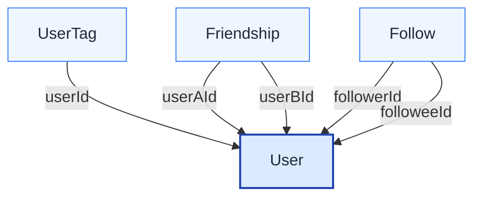

<!-- @generated by @metaobjectsdev/codegen-ts — DO NOT EDIT. -->

# User

> A member of the network.

**Type:** `object.entity`
**Source:** `meta.social.json`
**Package:** `acme::social`

## Identity

- **Primary key:** `id`

## In context

## Fields

| Field | Type | Required | Column | Rules |
|---|---|---|---|---|
| 🔑 `id` | `long` | yes |  |  |
| `name` | `string` | yes |  |  |

## Relationships

- `tags` — many → `Tag` (association, through `UserTag`)
- `friends` — many → `User` (association, through `Friendship`, symmetric self-join)
- `follows` — many → `User` (association, through `Follow`, directed self-join via `followerId`)
